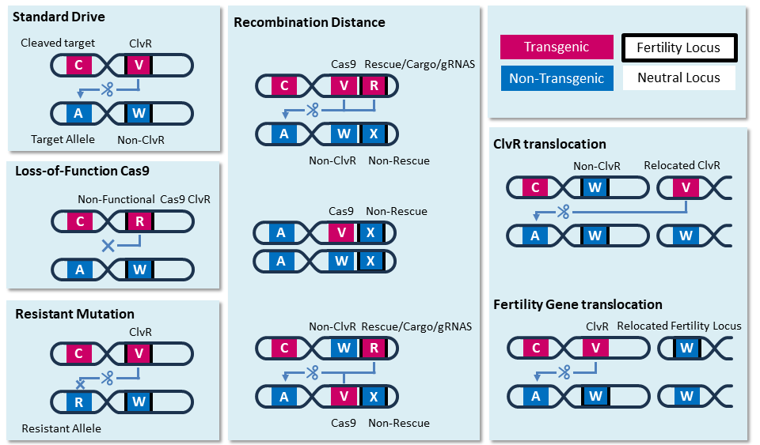

# PIGSS

Plants (Individuals) and Gametes Stochastic Simulation. Code for simulating plant populations using a Cleave and Rescue gamete killer

Demo Here: 

 

## How to use

To run the simulations, the files Simulation.py and SuppressorMutationClasses.py are required, as well as an empty folder called "final_data"

This module was written using Python 3.7, and requires the following python packages:
* pandas
* time
* tqdm
* numpy

The code is run from within the working directory, using the command

    python Simulation.py function_name

All data found in the paper was generated using the functions already written in these files. The names of the files they output to, and which figures this data was used in are listed below. Of note: each function actually generates three files. If the function is mapped to "filename_1" then it will generate the files "filename_1_adults.csv" "filename_1_allele.csv" and "filename_1_total.csv". All of these files will be located in a folder called arabidopsis_data. The "total" file stores the total population, split into males and females, for each generation. The "adults" file stores information on numbers of adults, broken down by genotype. For example, one line in the adults file could tell you that, for there were 15 females at generation 30 that had the genotype ClvR/ClvR Cleaved/Cleaved. THe "allele" file stores the number of alleles for each generation and sex. For example, if there were three females in a population with two alleles, one homozygous for A, two homozygous for B, and one heterozygous (AB), then the allele file would list 3 A and 5 B. 

Additionally, multiple runs will append to the same file (but are distinguishable by the "RUN" label). In the pre-defined functions, the Run label is a combination of maternal carryover and haploid fitness cost. In the main functioning for running simulations (run_stochastic_sim), one of the input variables is the number of runs to perform. This function takes in the Run label, and for each run will append the run number to the run label, and will write that new label out to the file. For example, an input Run label of "mcProb_0_fitCost_0.1" and a number of repetitions "2" will run twice, and will append the runs "mcProb_0_fitCost_0.1_1" and "mcProb_0_fitCost_0.1_2" to the output files. Each time a new run is appended, it also appends a header - this should be removed during data processing. 

<!-- TO DO: explain the file structure and what it means   -->
<!-- TO DO: explain why files are split into males and females?   -->
<!-- TO DO: explain the "RUN" label and its significance !!   -->
<!-- TO DO: explain the allele labels !!!   -->

Name | Behavior | File name (if applicable) | Figure data was used for (if applicable)
--- | --- | --- | ---
run_all_func | Runs all functions (Not Recommended for Data Generation, Recommended for Developing) | - | -
explore_modification_int10_onePartner, explore_modification_int10_fivePartner, explore_modification_int10_twentyPartner | a 10% introduction of ClvR for population modification | haploidFitCosts_int10_onePartner_noSterile, haploidFitCosts_int10_fivePartner_noSterile, haploidFitCosts_int10_twentyPartner_noSterile | Fig. 5, abc
explore_modification_int20_onePartner, explore_modification_int20_fivePartner, explore_modification_int20_twentyPartner | a 20% introduction of ClvR for population modification, for twenty males mating to one female | haploidFitCosts_int20_onePartner_noSterile, haploidFitCosts_int20_fivePartner_noSterile, haploidFitCosts_int20_twentyPartner_noSterile | Extended Data Fig. 7, abc
--- | --- | --- | ---
sterile_females_intro10_onePartner, sterile_females_intro10_fivePartner, sterile_females_int10_twentyPartner | a 10% introduction of ClvR for population suppression, where ClvR sits inside of a female fertility locus, rendering ClvR/ClvR females sterile | sterile_females_int10_onePartner, sterile_females_int10_fivePartner, sterile_females_int10_twentyPartner | Fig. 5, def
sterile_females_intro20_onePartner, sterile_females_intro20_fivePartner, sterile_females_intro20_twentyPartner | a 20% introduction of ClvR for population suppression, where ClvR sits inside of a female fertility locus, rendering ClvR/ClvR females sterile | sterile_females_int20_onePartner, sterile_females_int20_fivePartner, sterile_females_int20_twentyPartner | Extended Data Fig. 7, def
sterile_males_intro10_onePartner, sterile_males_intro10_fivePartner, sterile_males_intro10_twentyPartner | a 10% introduction of ClvR for population suppression, where ClvR sits inside of a male fertility locus, rendering ClvR/ClvR females sterile | sterile_males_int10_onePartner, sterile_males_int10_fivePartner, sterile_males_int10_twentyPartner | Fig. 5, ghi
sterile_males_intro20_onePartner, sterile_males_intro20_fivePartner, sterile_males_intro20_twentyPartner | a 20% introduction of ClvR for population suppression, where ClvR sits inside of a male fertility locus, rendering ClvR/ClvR females sterile | sterile_males_int20_onePartner, sterile_males_int20_fivePartner, sterile_males_int20_twentyPartner | Fig. Extended Data Fig. 7, ghi
--- | --- | --- | ---
lof_clvr_modification_if1_onePartner_MC, lof_clvr_modification_if1_fivePartner_MC, lof_clvr_modification_if1_twentyPartner_MC   | a 10% introduction of ClvR for population modification, where 1% of the introduced ClvR has a loss-of-function mutation in the Cas9, and therefore behaves as a Rescue-only allele. |  lof_modification_if1_fs_onePartner, lof_modification_if1_fs_fivePartner, lof_modification_if1_fs_twentyPartner | Fig. 6, c-d
lof_clvr_modification_if20_onePartner_MC, lof_clvr_modification_if20_fivPartner_MC, lof_clvr_modification_if20_onePartner_MC | a 10% introduction of ClvR for population modification, where 20% of the introduced ClvR (2% of the carrying capacity) has a loss-of-function mutation in Cas9, and therefore behaves as a Rescue-only allele. | lof_modification_if20_fs_onePartner, lof_modification_if20_fs_fivePartner, lof_modification_if20_fs_twentyPartner | NA
--- | --- | --- | ---
lof_clvr_suppression_if1_fs_onePartner, lof_clvr_suppression_if1_fs_fivePartner, lof_clvr_suppression_if1_fs_twentyPartner | a 10% introduction of ClvR for population suppression, where 1% of the introduced ClvR has a loss-of-function mutation in Cas9, and therefore behaves as a Rescue-only allele. | lof_suppression_if1_fs_onePartner, lof_suppression_if1_fs_fivePartner, lof_suppression_if1_fs_twentyPartner | Fig. 7
lof_clvr_suppression_if20_fs_onePartner, lof_clvr_suppression_if20_fs_fivePartner, lof_clvr_suppression_if20_fs_twentyPartner | a 20% introduction of ClvR for population suppression, where 20% of the introduced ClvR (2% of the carrying capacity) has a loss-of-function mutation in Cas9, and therefore behaves as a Rescue-only allele. | lof_suppression_if20_fs_onePartner, lof_suppression_if20_fs_fivePartner, lof_suppression_if20_fs_twentyPartner | Extended Data Fig. 9, a
lof_clvr_suppression_if20_fs_onePartner_manyRuns, lof_clvr_suppression_if20_fs_fivePartner_manyRuns, lof_clvr_suppression_if20_fs_twentyPartner_manyRuns | same as lof_clvr_suppression_if20_fs_one/five/twentyPartner, but instead of 20 runs/repetitions, runs for 100 | lof_suppression_if20_fs_onePartner_manyRuns, lof_suppression_if20_fs_fivePartner_manyRuns, lof_suppression_if20_fs_twentyPartner_manyRuns | NA
--- | --- | --- | ---
rd1_modification_onePartner, rd1_modification_fivePartner, rd1_modification_twentyPartner | a 10% introduction of ClvR for population modification, where the Cas9 and the Rescue/Cargo/gRNAs exist at two separate loci. There is a 1% chance of recombination occurring, such that the Cas9 will separate from the Rescue/Cargo allele, and the two will end up in different gametes. | rd_1_modification_onePartner, rd_1_modification_fivePartner, rd_1_modification_twentyPartner | Fig. 6, a-b
rd1_suppression_fs_onePartner, rd1_suppression_fs_fivePartner, rd1_suppression_fs_twentyPartner | a 10% introduction of ClvR for population modification, where the Cas9 and the Rescue/Cargo/gRNAs exist at two separate loci. The Rescue sits in a female fertility gene, thereby disrupting it, and cas9 has no impact on fertility. As above, a small chance of recombination occurs, leading to Cas9 to splitting from Rescue/Cargo. | rd_1_suppression_fs_onePartner, rd_1_suppression_fs_fivePartner, rd_1_suppression_fs_twentyPartner | Extended Data Fig. 9, b
rd1_suppression_fs_onePartner_manyRuns, rd1_suppression_fs_fivePartner_manyRuns, rd1_suppression_fs_twentyPartner_manyRuns | same as rd1_suppression_fs_onePartner_manyRuns above, but instead of 20 runs/repetitions, runs for 100 | rd_1_suppression_fs_onePartner_manyRuns, rd_1_suppression_fs_fivePartner_manyRuns, rd_1_suppression_fs_twentyPartner_manyRuns | NA
--- | --- | --- | ---
resistant_modification_int10_onePartner_haploid_fc, resistant_modification_int10_fivePartner_haploid_fc, resistant_modification_int10_twentyPartner_haploid_fc | a 10% introduction of ClvR homozygous individuals for modification (all males), along with a 10% introduction of non-ClvR individuals heterozygous for an uncleavable allele (half female, half male). | resistant_modification_heterozygotes_int10_onePartner, resistant_modification_heterozygotes_int10_fivePartner, resistant_modification_heterozygotes_int10_twentyPartner | NA
resistant_modification_int20_onePartner_haploid_fc, resistant_modification_int20_fivePartner_haploid_fc, resistant_modification_int20_twentyPartner_haploid_fc | the same as resistant_modification_int10_onePartner_haploid_fc, but for a 20% introduction on non-ClvR heterozygous resistant individuals (10% females and 10% males) | resistant_modification_heterozygotes_int20_onePartner, resistant_modification_heterozygotes_int20_fivePartner, resistant_modification_heterozygotes_int20_twentyPartner | NA
resistant_modification_int2_onePartner_haploid_fc, resistant_modification_int2_fivePartner_haploid_fc, resistant_modification_int2_twentyPartner_haploid_fc | the same as resistant_modification_int10_onePartner_haploid_fc, but for a 2% introduction on non-ClvR heterozygous resistant individuals (1% females and 1% males) | resistant_modification_heterozygotes_int2_onePartner, resistant_modification_heterozygotes_int2_fivePartner, resistant_modification_heterozygotes_int2_twentyPartner | Fig. 8, a-b
resistant_suppression_int_o1_femalesterile_onePartner   | a release of 10% ClvR males, and 0.1% individuals resistant to cleavage (half males, half females). | resistant_suppression_heterozygotes_int_o1_onePartner | NA

The faster simulation file, called "Simulation_fast_small.py" features its own select few functions, used for simulating very large populations. Unlike functions in Simulation.py, which automatically attach run labels based on the number of repetitions, these functions each take in a run label as well. For example, to run 3 runs:

    python Simulation_fast_small.py function_name 1
    python Simulation_fast_small.py function_name 2
    python Simulation_fast_small.py function_name 3

Or, when using a server such as slurm:

    for i in $(seq 1 10)
    do
        srun --ntasks 1 python3 Simulation_fast_small.py clvr_loci_jumping $i &
    done
    wait

A list of the large-population functions are as follows:

Name | Behavior | File name (if applicable) | Figure data was used for (if applicable)
-- | ----- | -- | --
RS_o0001percent_int10_femalesterile_onePartner | A release of 10% ClvR into a population of 100,000,000, along with a release of 0.0001% individuals heterozygous for a resistant mutation, which is uncleavable by ClvR. Only runs for 30 generations | resistant_suppression_into0001percent_int10_fs_onePartner | Fig. 8 c
RS_o0001percent_int20_femalesterile_onePartner | The same as RS_o0001percent_int10_femalesterile_onePartner, but for a release of 20% ClvR | resistant_suppression_into0001percent_int20_fs_onePartner | NA
RS_o0001percent_int10_femalesterile_onePartner_LONG, RS_o0001percent_int20_femalesterile_onePartner_LONG | The same as the above two functions, but instead of running for 30 generations, runs for 100 | resistant_suppression_into0001percent_int10_fs_onePartner_LONG, resistant_suppression_into0001percent_int20_fs_onePartner_LONG | NA
clvr_loci_jumping | A release of 10% ClvR into a population of 100,000,000, where the ClvR is inserted into a female fertility locus, leading to suppression. Either 0.0001% or 0.5% of those released individuals have had one of their ClvR re-located to a third locus which has no impact on fertility. | JumpingClvR_intVariable_femSterile_onePartner | Extended Data Fig. 10, ab
fertility_jumping | A release of 10% ClvR into a population of 100,000,000, where the ClvR is inserted into a female fertility locus, leading to suppression. Additionally, we release either 0.0001% or 0.5% wildtype individuals whose fertility loci has 'jumped' to a third locus. The fertility locus at this third site allows for ClvR homozygotes to be fertile | JumpingFertility_intVariable_femSterile_onePartner | Extended Data Fig. 10, cd

For efficiency, each allele is assigned a single letter. Here is an explanation of which allele represents what. Those with asterisks are not always used. Loci go from left to right, and in the case of suppression the "higher-numbered" loci, or the loci "farthest right" is always the fertility site:

Allele | Locus | Meaning
--- | --- | ---
"A" | 1 | Target Allele for Cleaving
"C" | 1 | Cleaved version of "A"
"R"* | 1 | An allele resistant to cleavage
"V" | 2 | ClvR allele, usually Cas9 + gRNAs/Cargo/Rescue. For recombination, V represents only Cas9
"W" | 2 | a wildtype, non-ClvR allele
"R"* | 2 | A Rescue-only allele, made of gRNAs + Cargo + Rescue. For LOF
"R"* | 3 | A Rescue-only allele, made of gRNAs + Cargo + Rescue, for Recombination. Will cause cleavage if in the presence of "V"
"X"* | 3 | The non-rescue, wildtype allele

## How it works

This model uses three classes, stored in PlantClasses.py, and two main functions, stored in Simulation.py, in order to simulate the classes. The lowest level class is Diploid, which tracks the genotypes and alleles of a single individual. The next highest class is Haploid, which tracks its own alleles and also its Diploid parent. The highest class, in which most of the data is stored, is StochasticSim. This class object contains all the parameters necessary to run a simulation, and can store the individuals that are created over the course of a simulation. The parameters stored by StochasticSim include the alleles and genotypes possible, the haploid and diploid fitnesses associated with each genotype, the fecundity of each individual, and other parameters used over the course of the simulation. The function stochastic_sim calls on a StochasticSim object to perform the simulation, and for each generation it takes the previous generation, generates gametes, mates gametes, and then produces adult diploid individuals for the next generation. The function stochastic_sim is called by run_stochastic_sim, which handles doing multiple runs and writing the data out to files. More on the specifics of stochastic_sim below.

<!-- TODO: Add more detail to above paragraph -->

Each generation starts with a pool of adult individuals, shown at the top in purple. This information is stored as a list where each index represents a possible genotype, and the associated value represents the number of individuals of that genotype. 
1. For each mating, a single mother produces a pool of ovules and multiple males produce a single pool of pollen.
2. The number of ovules and pollen are reduced, based on their haploid fitness costs Fh such that a pollen with no fitness costs will have a 100% chance of survival, and a pollen with fitness cost 0.1 will only have a 90% chance of surviving.
3. From the pool of possible pollen and ovules, each ovule is mated with a single pollen to produce a possible offspring.
4. The possible offspring are randomly grouped as male or female
5. The number of possible offspring is reduced to only those that survive. For each mating, the base chance of survival is 2 over the number of expected offspring o, as we expect each mating between a female and a male to produce 2 offspring when the population is at carrying capacity. This probability of survival is further modified by Fd, the fitness of the individual, and S. S denotes the density dependence function $S(P) = \frac{g}{1+(g-1)\frac{P}{K}}$ where P is the parent generation’s population size, and K is the carrying capacity. S ranges from some growth factor g > 1 at low densities, to 1 at densities near carrying capacity. The offspring that survive become the parents of the next generation.

## Additional Information

Data visualization was done using data_visualization.Rmd, and individual panels were added together using Inkscape. 

By breaking up datasets into smaller functions for running, multiple functions can be run simultaneous on a single machine. On my laptop (acer swift 3, model number SF314-42 with AMD Ryzen 7 4700U 8-core processor), simulations for a full population (10,000 individuals) would take just under 3 seconds/generation to run. On my friend's laptop (a nicer, newer mac) each generation ran in just under 2 seconds.

File are split into _adults (information on all possible genotypes of the adult individuals we are tracking), _allele (information on how many of a given allele exist in the population, in total, for each generation. Previously, allele was a count of how many individuals in the population contained at least 1 of said allele), and _total (population size).
